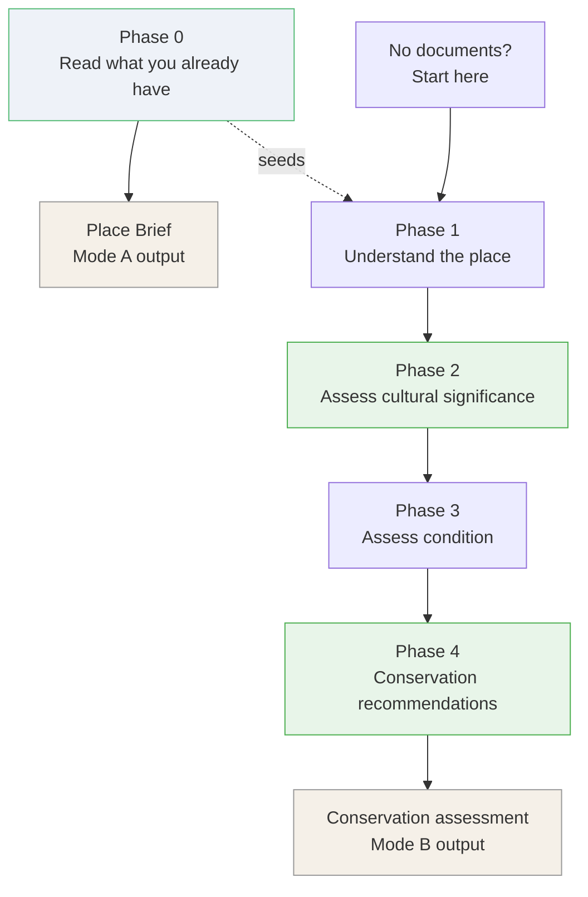

# heritage-copilot-skill

> **A heritage conservation copilot for Claude Code. Two modes: read the documents a
> place already has and turn them into a plain-English brief of what matters — and
> take a place through the Burra Charter process to significance-led conservation
> recommendations. Built for the people who care for small, low-resource heritage
> places.**


---

## Why this exists

Most heritage places are not grand institutions with conservation budgets. They are
community-run historic houses, small religious buildings, inherited listed homes,
council assets managed by generalists, rural sites far from specialist advice. The
people who care for them know the place matters — they just don't know what to do
next. Every digital tool built for the sector assumes knowledge and resources they
don't have.

This skill addresses two specific gaps for those custodians.

**1. The knowledge that never arrives.** When a heritage professional *has* produced
a Conservation Management Plan or a condition report, that document usually sits in a
filing cabinet. The knowledge it holds — what fabric is significant, what is
vulnerable, what must not be altered, what has failed before — never reaches the
volunteer who picks up the management task. Every new custodian starts from scratch.

**2. The wrong order.** Ask a general-purpose AI assistant about an old building with
a problem and it tells you how to fix the problem. In conservation that is the wrong
order. *What you do to a place is decided by what is significant about it* — not by
what is broken. Repair a window before you know whether the window matters and you
can quietly destroy the thing that made the place worth keeping.

Heritage practice has a settled answer to the second problem: assess significance
**first**, then let it govern every later decision. **The Burra Charter** — *The
Australia ICOMOS Charter for Places of Cultural Significance (2013)* — is the standard
used across Australia for exactly this, with one cautious principle at its centre:

> *Do as much as necessary to care for the place and to make it useable, but
> otherwise change it as little as possible so that its cultural significance is
> retained.*

This skill makes Claude Code do both: **surface what the documents already know**,
and **follow the Burra Charter discipline** instead of jumping to repairs.

---

## Two modes



| Mode | You want… | The skill runs | You get |
|------|-----------|----------------|---------|
| **A — Document brief** | To make sense of the documents a place already has | Phase 0 only | A **Place Brief** + structured Place Profile |
| **B — Conservation assessment** | A place assessed and works recommended | Phase 0 (if documents exist) → Phases 1–4 | A **conservation assessment report** |

Mode A is a complete, useful job on its own — *"I have a 60-page CMP, just tell me
what I actually need to know."* Mode B uses the same Phase 0 as its starting point,
so a custodian never re-types what a consultant already wrote.

---

## How it works — the phases

### Phase 0 — Read what you already have

The skill ingests whatever heritage documents the place has — Conservation Management
Plans, Heritage Impact Assessments, statements of significance, asset and maintenance
plans, old condition reports, heritage register entries, archival notes — in PDF,
Word, plain text, or pasted text. It extracts a structured **Place Profile**:

- **Significance summary** — what makes the place matter
- **Significant fabric** — elements named as significant, with their stated level
- **Known vulnerabilities** — defects and risks already identified
- **Conservation policies and constraints** — what must not be altered, what requires
  consent (often implicit — *"where practicable"*, *"subject to approval"*)
- **Maintenance history** — past works and when they were done
- **Outstanding actions** — recommended works not yet completed
- **Source documents** — with an extraction-confidence note for each

Every item is traced to its source document. Contradictions between documents are
recorded, not silently resolved. Low-confidence extractions are flagged for review.
The skill **only extracts what is written** — it never infers facts that are not
there. From the profile it writes a plain-English **Place Brief** a volunteer can
read in a few minutes. *(See [place_profile.md](skill/reference/place_profile.md).)*

### Phase 1 — Understand the place

A neutral profile before any judgement: identity and use, fabric and materials,
history, context, statutory status. If Phase 0 ran, this **starts from the Place
Profile** and just confirms and fills gaps. Unsourced facts are marked "evidence
needed", never guessed.

### Phase 2 — Assess cultural significance

Assessment against the Burra Charter value categories, a plain-language **Statement
of Significance**, and an element-by-element significance grade:

| Significance grade | Meaning | Conservation implication |
|--------------------|---------|--------------------------|
| **Exceptional** | Rare or outstanding fabric central to significance | Retain and preserve |
| **High** | Contributes strongly to significance | Retain; repair before replace |
| **Moderate** | Supports significance or typical of the place | Retain where practical |
| **Little** | Neither adds to nor detracts from significance | Change acceptable if no harm to significant fabric |
| **Intrusive** | Detracts from significance (poor later additions) | A candidate for removal |

An existing Statement of Significance found in Phase 0 is **reviewed and built on**,
not discarded.

### Phase 3 — Assess condition

Each element rated on a four-level rubric — a separate axis from significance:

| Condition | Headline | Who acts |
|-----------|----------|----------|
| **Good** | Stable — revisit at the next annual check | Owner / monitor |
| **Fair** | Routine upkeep — repaint, clean or seal | Owner or general tradesperson |
| **Poor** | Consult a heritage professional | Heritage-experienced trade, 3–6 months |
| **Critical** | Seek urgent specialist heritage advice | Heritage practitioner / engineer, urgent |

Vulnerabilities flagged in Phase 0 are each checked specifically. The skill is told
not to mistake the patina of age for damage.

### Phase 4 — Develop conservation recommendations

Significance × condition sets priority. For every element the skill works a
**three-question test** — *Do you need to do anything? → What is the least you can
do? → How have others solved it?* — then recommends a Burra Charter conservation
process (maintenance, preservation, restoration, reconstruction, adaptation) with an
urgency, a *who*, and a reversibility note. Conservation policies and outstanding
actions from Phase 0 are honoured automatically. Recommendations are sequenced:
safety first, then significant fabric at risk, then maintenance, then intrusive
elements.

---

## The rules it never breaks

These hard rules are embedded in the skill and override everything else.

| # | Rule | Basis |
|---|------|-------|
| 1 | **Significance leads.** No works recommended before significance is assessed. | Burra Charter Art. 2.2 |
| 2 | **Cautious approach.** As much as necessary, as little as possible. | Art. 3 |
| 3 | **Retain significant fabric.** Repair before replace; prefer reversible change. | Art. 4, 15 |
| 4 | **Do not invent.** Extract and assess only what the evidence shows; gaps are flagged, never guessed. | — |
| 5 | **Respect all values** — including Aboriginal, community and spiritual associations. | Art. 24–26 |
| 6 | **State the limit.** Every output notes it is a draft, not a substitute for a qualified practitioner. | — |

---

## What you provide

Nothing is mandatory — the skill works with whatever you have and flags what is
missing.

| Input | Used in | Notes |
|-------|---------|-------|
| Heritage documents (CMP, HIA, condition reports, listings, asset plans, notes) | Phase 0 | PDF, Word, text, or pasted. Typed notes count. |
| Place name, address, current use | Phase 1 | — |
| Photographs of the place and its elements | Phases 1, 3 | The more, the better the condition read |
| Description of fabric and materials | Phases 1, 3 | Walls, roof, joinery, setting, landscape |
| History — dates, alterations, owners, uses | Phases 1, 2 | Sources cited; unsourced facts flagged |
| Existing heritage listing | Phases 1, 2 | Local, state or National |
| Your goal | Phase 4 | Sale, repair, adaptation, maintenance, listing |

---

## Install

Clone the repository, then copy the skill into your Claude Code skills directory:

```bash
git clone https://github.com/mightytonylun/heritage-copilot-skill.git
mkdir -p ~/.claude/skills/heritage-copilot
cp -R heritage-copilot-skill/skill/* ~/.claude/skills/heritage-copilot/
```

The skill is a plain `SKILL.md` plus four Markdown reference files — no dependencies,
no build step.

## Use

Invoke it directly:

```text
/heritage-copilot
```

Or just ask in natural language:

```text
Summarise this Conservation Management Plan — what do I actually need to know?
Assess this heritage cottage and recommend conservation works.
Draft a Statement of Significance for this place.
```

The skill establishes which mode you want, asks what documents and evidence you have,
then works through the phases, pausing where your input is needed.

## Output

Mode A produces a **Place Brief**; Mode B produces a **conservation assessment**:

```text
[place_name]_place_brief.md                 [place_name]_conservation_assessment.md
├── Place Brief (plain-English summary)      ├── 1. Place profile
├── Place Profile (structured extraction)    ├── 2. Statement of Significance + grading
├── Source documents + confidence            ├── 3. Condition summary table
└── Limitations note                         ├── 4. Prioritised recommendations
                                             ├── 5. Evidence gaps and next steps
                                             └── 6. Limitations note
```

Both are plain Markdown for a person to review. Language is kept accessible — the
primary reader is often an owner or volunteer, not a specialist.

---

## Example

An illustrative slice of a Phase 4 recommendation for a fictional late-Victorian
weatherboard cottage:

> **Element:** Front verandah cast-iron lacework
> **Significance:** High — contributes strongly to the cottage's aesthetic value.
> **Condition:** Fair — surface corrosion, paint weathered and peeling; iron sound
> beneath, no section loss. *(Flagged as a known vulnerability in the 2015 CMP —
> Phase 0.)*
>
> **Three-question test**
> 1. *Do you need to do anything?* Yes — paint failure is exposing iron to weather,
>    though the lacework itself is not yet deteriorating.
> 2. *What is the least you can do?* Hand-prepare, treat the corrosion, repaint in a
>    period-appropriate scheme. No replacement of iron.
> 3. *How have others solved it?* Standard cyclical maintenance for cast-iron detail.
>
> **Recommendation:** Maintenance. Owner or general tradesperson. Within 12 months.
> Do **not** replace the lacework — the existing iron is significant fabric and
> sound. *(The CMP lists the lacework as significant fabric "to be retained" — that
> constraint governs this recommendation.)*

A full anonymised worked example is on the [Roadmap](#roadmap).

---

## What it is *not*

- It does **not** replace a qualified heritage practitioner, structural engineer, or
  statutory heritage advice. It produces a reviewable draft.
- It does **not** invent history, significance, or document content. It extracts and
  assesses only what the evidence shows, and flags gaps.
- It does **not** make automated decisions. Every output is for a person to review.
- It does **not** reproduce the Burra Charter text. The Charter is copyright Australia
  ICOMOS; the skill describes the *process* and cites Article numbers. Authoritative
  wording is at [australia.icomos.org](https://australia.icomos.org).

---

## Project structure

```text
heritage-copilot-skill/
├── README.md
├── LICENSE
└── skill/
    ├── SKILL.md                          # the skill — two modes, Phase 0 + Phases 1-4
    └── reference/
        ├── place_profile.md              # Phase 0 — reading documents, the Place Profile
        ├── significance_assessment.md    # Phase 2 — value categories, Statement of Significance
        ├── condition_rubric.md           # Phase 3 — four-level condition rubric
        └── heritage_materials.md         # Phases 3-4 — traditional materials, common mistakes
```

---

## Background

This skill grew out of **STEWRD Heritage Copilot**, a research project on management
tools for small and low-budget heritage sites. Phase 0 is a distilled, open
adaptation of STEWRD's *Heritage Document Analyser* concept — making the knowledge in
a place's existing documents reach the people who care for it day to day.

---

## Roadmap

This is an early release. Planned directions, roughly in order:

- [ ] A full anonymised worked example (Mode A and Mode B, start to finish)
- [ ] Worked examples for a public building and a cultural landscape
- [ ] Conservation Management Plan (CMP) drafting support
- [ ] Aboriginal cultural heritage handled with appropriate care and protocols
- [ ] Additional framework adaptations beyond the Burra Charter, once the Australian
      workflow is proven

---

## Contributing

Contributions are welcome, especially from practising heritage professionals.
Useful contributions include:

- anonymised worked examples (free of identifying details for private places)
- refinements to the significance method, the condition rubric, or the document
  extraction structure
- corrections to the traditional-materials guidance
- new framework adaptations for other jurisdictions

Please open an issue to discuss substantial changes before a pull request.

---

## Acknowledgements

The conservation process and principles followed here are those of **The Burra
Charter: The Australia ICOMOS Charter for Places of Cultural Significance, 2013**,
© Australia ICOMOS Incorporated.

The three-question decision test and the traditional-materials guidance draw on
**Conservation Guidelines for Building Surveyors** by Peter Phillips and Don Truman,
© Australia ICOMOS Inc. 2002 — paraphrased for non-commercial training use with
acknowledgement, per that document's stated terms.

This skill is an independent aid to applying these documents. It is **not** endorsed
by, affiliated with, or produced by Australia ICOMOS.

## License

MIT — see [LICENSE](LICENSE). Note that the referenced charters and guidelines remain
the copyright of Australia ICOMOS; this licence covers the skill's own text only.
