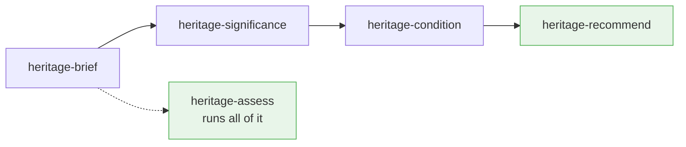

# heritage-copilot-skill

> **A heritage conservation copilot — a skill pack of five commands that help the
> people who care for small, low-resource heritage places: read their documents,
> assess significance and condition, and decide what conservation works to do.
> Built on the Burra Charter.**


---

## Why this exists

Most heritage places are not grand institutions with conservation budgets. They are
community-run historic houses, small religious buildings, inherited listed homes,
council assets managed by generalists, rural sites far from specialist advice. The
people who care for them know the place matters — they just don't know what to do
next. Every digital tool built for the sector assumes knowledge and resources they
don't have.

This skill addresses two specific gaps for those custodians.

**1. The knowledge that never arrives.** When a heritage professional *has* produced
a Conservation Management Plan or a condition report, that document usually sits in a
filing cabinet. What fabric is significant, what is vulnerable, what must not be
altered — it never reaches the volunteer who picks up the management task.

**2. The wrong order.** Ask a general-purpose AI assistant about an old building with
a problem and it tells you how to fix the problem. In conservation that is the wrong
order. *What you do to a place is decided by what is significant about it* — not by
what is broken.

Heritage practice has a settled answer: assess significance **first**, then let it
govern every later decision. **The Burra Charter** — *The Australia ICOMOS Charter
for Places of Cultural Significance (2013)* — is the standard used across Australia,
with one cautious principle at its centre:

> *Do as much as necessary to care for the place and to make it useable, but
> otherwise change it as little as possible so that its cultural significance is
> retained.*

---

## The commands

`heritage-copilot` is **five commands**, not one monolithic report. Run the whole
sequence, or jump straight to the one piece of work you need — each command produces
a complete, useful result on its own.

| Command | What it does | Output |
|---------|--------------|--------|
| `/heritage-brief` | Reads the heritage documents a place already has (CMPs, condition reports, listings, statements of significance) | Plain-English **Place Brief** + structured Place Profile |
| `/heritage-significance` | Assesses cultural significance against the Burra Charter value categories | **Statement of Significance** + element grading |
| `/heritage-condition` | Assesses physical condition from photos or notes | **Condition snapshot** — each element Good / Fair / Poor / Critical |
| `/heritage-recommend` | Combines significance × condition into a plan | **Prioritised conservation recommendations** |
| `/heritage-assess` | Runs the whole sequence end to end | **Full conservation assessment report** |

Each command surfaces its result **on screen as it works** — you don't wait for a
finished file to see anything.

### Independent entry points, one discipline

The commands are independent, but they are not pick-and-mix. The Burra Charter logic
still holds: **significance leads.** `/heritage-recommend` will not produce
conservation works without a significance assessment — if you run it cold, it asks
for significance first (or points you to `/heritage-significance`). You can *enter*
the process at the right point for your task; you cannot skip the thinking.



---

## The rules every command keeps

| # | Rule | Basis |
|---|------|-------|
| 1 | **Significance leads.** No conservation works recommended before significance is assessed. | Burra Charter Art. 2.2 |
| 2 | **Cautious approach.** As much as necessary, as little as possible. | Art. 3 |
| 3 | **Retain significant fabric.** Repair before replace; prefer reversible change. | Art. 4, 15 |
| 4 | **Do not invent.** Extract and assess only what the evidence shows; gaps are flagged, never guessed. | — |
| 5 | **Respect all values** — including Aboriginal, community and spiritual associations. | Art. 24–26 |
| 6 | **State the limit.** Every output notes it is a draft, not a substitute for a qualified practitioner. | — |

---

## What it is *not*

- It does **not** replace a qualified heritage practitioner, structural engineer, or
  statutory heritage advice. It produces reviewable drafts.
- It does **not** invent history, significance, or document content.
- It does **not** make automated decisions. Every output is for a person to review.
- It does **not** reproduce the Burra Charter text (copyright Australia ICOMOS). It
  describes the *process* and cites Article numbers; authoritative wording is at
  [australia.icomos.org](https://australia.icomos.org).

---

## Install

The pack is currently packaged for **Claude Code** (support for other agent
environments is on the roadmap). Clone the repository and copy the commands into your
skills directory:

```bash
git clone https://github.com/mightytonylun/heritage-copilot-skill.git
cp -R heritage-copilot-skill/skills/* ~/.claude/skills/
```

That installs all five commands. Each is a self-contained folder (a `SKILL.md` plus
its `reference/` files) — no dependencies, no build step. To install just one, copy
only that folder, e.g. `cp -R heritage-copilot-skill/skills/heritage-brief ~/.claude/skills/`.

## Use

Invoke any command directly:

```text
/heritage-brief          summarise the documents a place has
/heritage-significance   draft or review a Statement of Significance
/heritage-condition      a condition check from photos
/heritage-recommend      prioritised conservation works
/heritage-assess         the full assessment, end to end
```

Or just ask in natural language — *"summarise this Conservation Management Plan"*,
*"what conservation works does this cottage need?"* — and the matching command runs.

---

## Project structure

```text
heritage-copilot-skill/
├── README.md
├── LICENSE
└── skills/
    ├── heritage-brief/        SKILL.md + reference/place_profile.md
    ├── heritage-significance/ SKILL.md + reference/significance_assessment.md
    ├── heritage-condition/    SKILL.md + reference/{condition_rubric, heritage_materials}.md
    ├── heritage-recommend/    SKILL.md + reference/heritage_materials.md
    └── heritage-assess/       SKILL.md + reference/ (all four)
```

Each command bundles the reference files it uses, so every command folder installs
and runs on its own.

---

## Background

This skill grew out of **STEWRD Heritage Copilot**, a research project on management
tools for small and low-budget heritage sites. `/heritage-brief` is a distilled, open
adaptation of STEWRD's *Heritage Document Analyser* concept — making the knowledge in
a place's existing documents reach the people who care for it day to day.

It has been tested end to end on a real 184-page Conservation Management Plan (the
Queen Victoria Market CMP, 2003).

---

## Roadmap

- [ ] A full anonymised worked example (a complete `heritage-assess` run)
- [ ] Worked examples for a public building and a cultural landscape
- [ ] Conservation Management Plan (CMP) drafting support
- [ ] Aboriginal cultural heritage handled with appropriate care and protocols
- [ ] Additional framework adaptations beyond the Burra Charter
- [ ] Support for agent environments beyond Claude Code

---

## Contributing

Contributions are welcome, especially from practising heritage professionals:
anonymised worked examples, refinements to the significance method, condition rubric,
or document-extraction structure, corrections to the traditional-materials guidance,
and new framework adaptations. Please open an issue before a substantial pull request.

---

## Acknowledgements

The conservation process and principles followed here are those of **The Burra
Charter: The Australia ICOMOS Charter for Places of Cultural Significance, 2013**,
© Australia ICOMOS Incorporated.

The three-question decision test and the traditional-materials guidance draw on
**Conservation Guidelines for Building Surveyors** by Peter Phillips and Don Truman,
© Australia ICOMOS Inc. 2002 — paraphrased for non-commercial training use with
acknowledgement, per that document's stated terms.

This skill is an independent aid to applying these documents. It is **not** endorsed
by, affiliated with, or produced by Australia ICOMOS.

## License

MIT — see [LICENSE](LICENSE). The referenced charters and guidelines remain the
copyright of Australia ICOMOS; this licence covers the skill's own text only.
